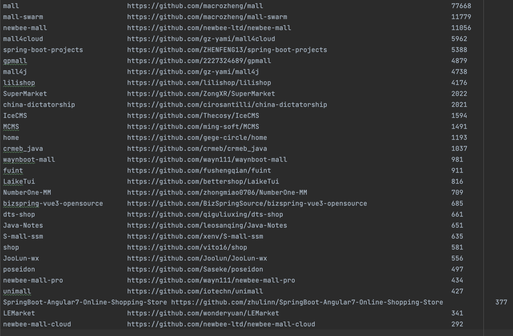

# pterosaur

java -jar /Users/luca/dev/2025/pterosaur/target/pterosaur-0.0.1-SNAPSHOT.jar
/Users/luca/dev/2025/pterosaur/output/popular-components/amqp-client/output/tpl_sort.txt
/Users/luca/dev/2025/pterosaur/output/popular-components/amqp-client/downstream/amqp-client-5.22.0.jar,/Users/luca/dev/2025/pterosaur/output/popular-components/amqp-client/downstream/vertx-rabbitmq-client-4.5.10.jar
/Users/luca/dev/2025/pterosaur/llm/input/code/pilot-test.txt 0

java -jar /Users/luca/dev/2025/pterosaur/target/pterosaur-0.0.1-SNAPSHOT.jar
/Users/luca/dev/2025/pterosaur/output/popular-components/amqp-client/output/tpl_sort.txt
/Users/luca/dev/2025/pterosaur/output/popular-components/amqp-client/downstream
/Users/luca/dev/2025/pterosaur/llm/input/code/pilot-test.txt 0

# 1.get the top upstream jars & applications

(1)rank website
https://libraries.io/search?order=desc&platforms=Maven&sort=rank

(2)run script to get top star apps in github
[GitHubTopProjectsFetcher.java](src%2Fmain%2Fjava%2Fedu%2Ffudan%2Fpterosaur%2Fscript%2FGitHubTopProjectsFetcher.java)
The result will be stored in the output/tpl.txt

# 2.get the downstream jars

(1)usage in maven central
https://mvnrepository.com/artifact/com.alibaba/fastjson/2.0.53

(2)add the GAV in the txt which will be used in (2)
[pilots.txt](scripts%2Ffastjson%2Fpilots.txt)

(3)run script to get the jars
[porter.py](scripts%2Fporter.py)
[downstream](output%2Fpopular-components%2Ffastjson%2Fdownstream)

# 3.get the call chains from downstream jar to upstream jar(TPL)

[TPLDetector.java](src%2Fmain%2Fjava%2Fedu%2Ffudan%2Fpterosaur%2Fdetector%2FTPLDetector.java)
(1)config class path
the path should be the downstream jars folder

(2)config tpl package
the package name should be the TPL package name

(3)run script to the get call
[tpl.txt](output%2Ftpl.txt)

# 4.further processing for tpl.txt

(1)copy the result of call chains into the corresponding folder
[tpl.txt](output%2Fpopular-components%2Ffastjson%2Foutput%2Ftpl.txt)

(2)sort the result
[1_sort.py](scripts%2F1_sort.py)
[tpl_sort.txt](output%2Fpopular-components%2Ffastjson%2Foutput%2Ftpl_sort.txt)

(3)filter the result
[2_filter.py](scripts%2F2_filter.py)

# 5.generate the prompt for LLM

(1)get the k-dep IR
[CodeProvider.java](src%2Fmain%2Fjava%2Fedu%2Ffudan%2Fpterosaur%2Fscript%2FCodeProvider.java)

parm0 is the file path of the tpl_sort.txt
parm1 is the soot clas path (downstream jars folder path)
parm2 is the output path
parm3 controls whether to check all entries, it can be always 0(false)
parm4 is the dep of the call stack

e.g.
nohup /home/luca/env/jdk-17.0.13/bin/java -jar /home/luca/pterosaur-0.0.1-SNAPSHOT.jar
/home/luca/lib/pterosaur/output/popular-components/fastjson/output/tpl_sort.txt
/home/luca/lib/pterosaur/output/popular-components/fastjson/downstream
/home/luca/lib/pterosaur/llm/input/code/IR-fastjson.txt 0 3 > output-fastjson.log 2>&1 &

[IR-fastjson.txt](llm%2Finput%2Fcode%2FIR-fastjson.txt)

(2)construct prompt for LLM
[summary-generator.py](scripts%2Fz-llm%2Fsummary-generator.py)

the result will be stored in this file "conversation-fastjson.txt"
[conversation-fastjson.txt](llm%2Foutput%2Fconversation-fastjson.txt)

(3)get the propagation rules from the conversation
[rule-generator.py](scripts%2Fz-llm%2Frule-generator.py)

the result will be stored in this file "propagation-rule-fastjson.txt"
[propagation-rule-fastjson.txt](llm%2Foutput%2Frules%2Fpropagation-rule-fastjson.txt)

Also, there is dynamic test to get the real class based on the unit test

(1)reflection and invoke the method which is annotated @Test
[MethodInterceptor.java](src%2Fmain%2Fjava%2Fedu%2Ffudan%2Fpterosaur%2Fscript%2FMethodInterceptor.java)

(2)run the maven test by using the maven plugin
https://github.com/Lucarun/instrument-maven-plugin

